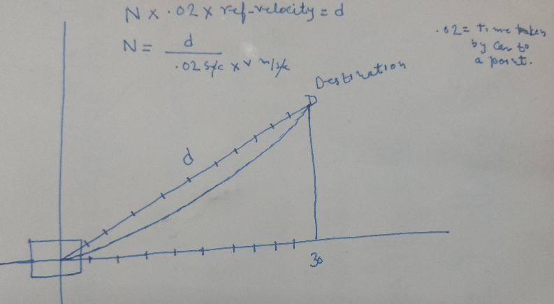

# CarND-Path-Planning-Project
Self-Driving Car Engineer Nanodegree Program
   
## Project Goal :
The goal in this project is to build a path planner that creates smooth, safe trajectories for the car to follow.
* Safely navigate around a virtual highway with other traffic that is driving +-10 MPH of the 50 MPH speed limit.
* The car should try to go as close as possible to the 50 MPH speed limit.
* Other cars will try to change lanes too. The car should avoid hitting other cars at all cost as well as driving inside of the marked road lanes at all times, unless going from one lane to another.
* The car should be able to make one complete loop around the 6946m highway.
* Since the car is trying to go 50 MPH, it should take a little over 5 minutes to complete 1 loop.
* The car should not experience total acceleration over 10 m/s^2 and jerk that is greater than 50 m/s^3.

## Project Details :
Below is the brief detail how solution works:
* Car drive in lane to reach the goal and maximum speed it can be go upto 49.5 mph. I took 
* If there is other car in lane and blocking the movement of car, then car will see if there is available lane to change. If yes, then car will keep the speed and change the lane.
* If there is no other lane available for change, car will slow down its speed in current lane to avoid collision.

## Different inputs:
Below are list of the input available for this projects.
* highway_map.csv, This consist of different waypoints on the highway. It has x,y,s,dx and dy value for each waypoints.
* we have sensors_fusion data which consist of data for other cars on highway.It has carids and then values such as x,y,vx,vy,s,d for that car. Its two dimesnional vectors
* Localization data for ego car. it consist of car_x, car_y, car_s, car_d, car_yaw, speed
* Similator also provide the previous path data as well. This would help for smoth transitions. 

## Project Directory structures :

Below is the directory structure of the projects.
1.  data directory which consist of highway_map.csv
2. src directory which consist of following files.
* main.cpp : Main file which send the updated x,y value to simulator to drive the car on highway 
* Helper.cpp and Helper.h : There are lots of helper function which provided along the project . I included everything in one class , so other files/class can use them easily. Also added additional function to print Debug Info on the console window.
* PathPlanner.cpp and PathPlanner.h : This class is main responsible of path planning . Driving the car safely and doing the lane change without collision.
* spline.h : In order to estimate the location of points between the known waypoints, we need to "interpolate" the position of those points. Spilne can be used for this task. It is simple to use and requiring no dependencies.

## Key points and their Explanation : 
Below are the different key points and their details.

## Cold start and Jerk
In the start, I could see the jerk alert, it was because ego car was attaining ref velocity in .02 sec. This was fixed by setting ref_vel to 0 and making incremental change in velocity with  .224 which is approx 5 m/sec^2 below the limit of 10 m/sec^2.
```cpp
for(unsigned int i = 1  ; i <= 50 - previous_path_x.size() ; i++)
	{
		if (car_speed < ref_vel)
		{
			car_speed += .224;
		}
		else if (car_speed > ref_vel)
		{
			car_speed -= .224;
		}

```
## Keep lane and smooth transitions
We are using frenet to keep lane and for smooth transition and jerk or avoid max accelration warning, we are using three previous way spaaced with 30m, 60m and at 90m and then using spline we add those points on spline using spline lib set functions. below image would explain better how does it works.




The objective of this project to achieve highway driving without any collision , jerk , out of lane and reach the goal. Below are the functions which does this job (called from main.cpp) : 

```cpp

pathplanner.GetCurrentVelocity(lane, car_s, car_d, sensor_fusion, prev_size, ref_vel, min_left_dist, min_right_dist, too_close, closest);

pathplanner.FollowLane(map_waypoints_x, map_waypoints_y, map_waypoints_s, previous_path_x, previous_path_y, car_x, car_y, car_yaw, car_speed, car_s, ref_vel, lane, next_x_vals, next_y_vals);

if (too_close)
{
    pathplanner.ChangeLane(too_close, min_left_dist, min_right_dist, lane, keep_lane);
}

```
a) These function check if the car should keep driving in the same lane or should change to another one. It also resolves what should be the Ego car's speed.  

b) The car updates its velocity using GetCurrentVelocity() function, depending on what is going on around it ( Example : if there is a car in front of it).    

c) Then it checks if it should keep its current lane or change it -PathPlanner::FollowLane().  

- The implementation is same as explained in project Q & A. it starts the new path with whatever previous path points were left over from the last cycle. Then append new waypoints, until the new path has 50 total waypoints.

- Using information from the previous path ensures that there is a smooth transition from cycle to cycle. But the more waypoints we use from the previous path, the less the new path will reflect dynamic changes in the environment. we used only last waypoint from the previous path and then generate the rest of the new path based on new data from the car's sensor fusion information. 

- Note that we are using Frenet coordinate to add 30 evenly spaced points ahead of the start points using getXY() helper function. And before calculation we transform the coordinate into car coordinates. At the end, before sending next x, next y values to simulator, it rotate back to normal after rotating it earlier.  

c) And finally, if it is safe to do it, it will change to another lane for overtaking the car in front of it using ChangeLane() function.   

### Result :
Below is my observation :  
a) The car is able to drive safe during all the period. I checked ~ 18 mile without any issue.  
b) It takes ~ 5-6 min. to complete a lap of 4.32 miles depending on the amount of traffic and its particular configuration.  
c) The car is able to lane change when free lane available without any noticeable jerk .  
d) The car is able to slow down its speed when no lane change available and front car is nearby.   

### Conclusion :
The car is able to run without any issue and done a reasonable job in driving, however there are lots of things can be improved :  
a) There are cases where it does not take the wisest path.  
b) I have not implemented separately cost function and finite state machine. This will help in dealing with more complex and real scenarios.  
c) Incorporate a controller such as PID or MPC that follows the Path Planner's output path. 
